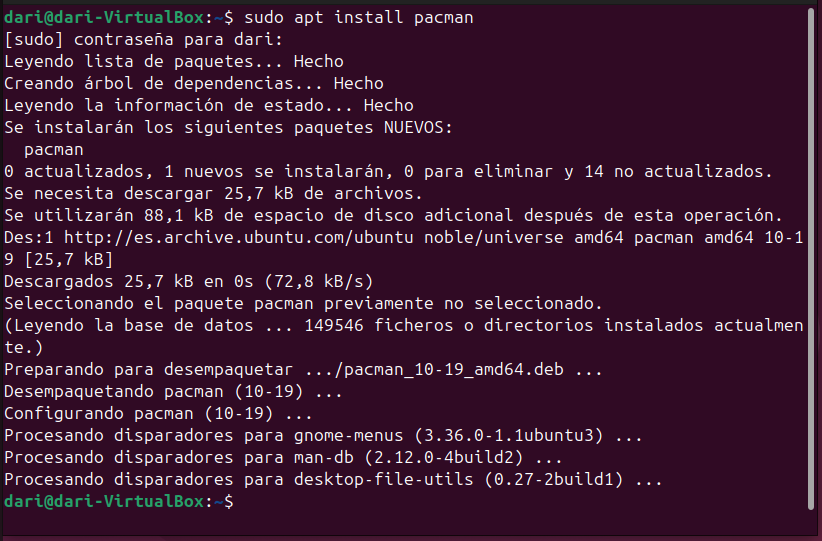
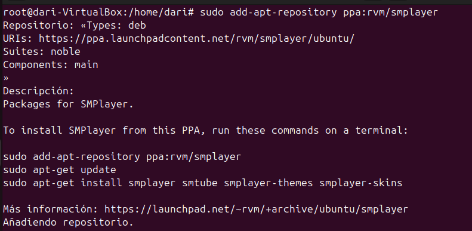

# __Instalación de programas__

En este apartado instalaremos aplicaciones en Ubuntu usando diferentes formas. 

### __Entorno Gráfico__
Actualmente, Ubuntu ofrece la instalación de programas mediante su App Center. ES tan fácil como buscar la aplicación y descargarla mediante clicks.

### __Apt Install__

__Apt install__ es parte del conjunto de comandos de APT (Advanced Package Tool), que es el sistema de gestión de paquetes predeterminado en Ubuntu y Debian. Este comando se usa para instalar paquetes de software desde los repositorios oficiales o desde otras fuentes configuradas.

Funcionamiento de apt install:
Instalación de paquetes: Cuando ejecutas sudo apt install nombre_paquete, APT se conecta a los repositorios configurados, descarga el paquete, junto con las dependencias necesarias, y lo instala en el sistema.

Ahora después de instalarlo, en la misma consola escribo "pacman" para comprobar que se ha instalado correctamente y puedo jugar.

Ahora voy a borrarlo.

### __Aptitude__

__Aptitude__ es otra herramienta de gestión de paquetes en Debian y Ubuntu que ofrece más funcionalidades que apt. Es más avanzado y ofrece tanto una interfaz de texto interactiva como un conjunto de comandos de línea similar a apt.

Funcionamiento de aptitude:
Interfaz gráfica en la terminal: Puedes lanzar una interfaz interactiva en la terminal donde puedes navegar, buscar, instalar, eliminar o actualizar paquetes con un sistema de menús.

### __DPKG__

__Dpkg__ se utiliza principalmente para instalar, eliminar y gestionar paquetes .deb de manera directa.

Conceptos básicos sobre dpkg:
Paquetes .deb: Los paquetes que dpkg maneja tienen la extensión .deb, que es el formato estándar de los paquetes de software en sistemas basados en Debian, como Ubuntu.

Instalación manual: A diferencia de apt, que se encarga de descargar los paquetes y resolver las dependencias automáticamente, dpkg se usa principalmente para instalar paquetes locales que ya has descargado en tu equipo.

### __Añadir repositorios__

Añadir repositorios en Ubuntu permite acceder a software que no está en los repositorios oficiales, como versiones más recientes o programas propietarios (por ejemplo, Google Chrome o controladores de hardware). También facilita actualizaciones automáticas. Los repositorios son fuentes seguras y verificadas que permiten instalar y actualizar software de forma sencilla.

### __Pinning Packet__

El pinning de paquetes en sistemas Debian/Ubuntu te permite decidir de qué repositorio quieres instalar un paquete y qué versión prefieres. Esto es útil si necesitas una versión específica y no quieres que se actualice automáticamente desde otros repositorios. Básicamente, es una forma de tener más control sobre qué software y actualizaciones instalas en tu sistema.

Muestra la ejecución del comando apt-cache policy smplayer, que permite ver la versión disponible y la instalada de SMPlayer en el sistema. No hay ninguna versión instalada, y la candidata es la 23.12.0.

---
Se está añadiendo un repositorio PPA (Personal Package Archive) con sudo add-apt-repository ppa:rvm/smplayer. Esto es útil para instalar versiones más recientes de SMPlayer que no están disponibles en los repositorios oficiales de Ubuntu.

---
Muestra el uso de nano para editar un archivo de preferencias de apt con nano apt-preferences, que permitirá ajustar la prioridad de las versiones de SMPlayer.

---
Se muestra la edición del archivo apt_preferences en el cual se establece la prioridad del paquete smplayer desde el repositorio PPA con una prioridad de 400. Esto indica que se le está dando preferencia a este repositorio para evitar la instalación automática desde otras fuentes.

---
Luego de ajustar las preferencias, se verifica de nuevo la versión disponible con apt-cache policy smplayer, y la versión candidata vuelve a ser la 23.12.0, lo que sugiere que la prioridad establecida podría estar afectando la selección del paquete.

---
Se intenta instalar SMPlayer con apt-get install smplayer. Esto iniciará el proceso de instalación, utilizando la versión disponible según la prioridad configurada previamente.

---
Finalmente, se revisa de nuevo el estado del paquete smplayer con apt-cache policy smplayer, mostrando que la versión instalada es la 23.12.0, que es la misma que la candidata.Finalmente, se revisa de nuevo el estado del paquete smplayer con apt-cache policy smplayer, mostrando que la versión instalada es la 23.12.0, que es la misma que la candidata.
