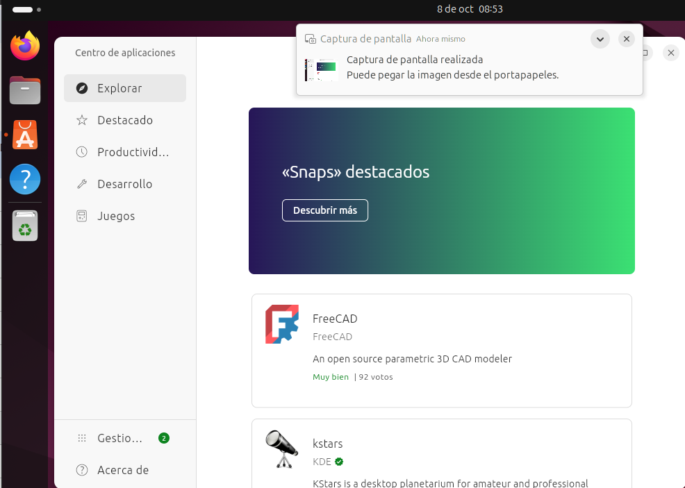
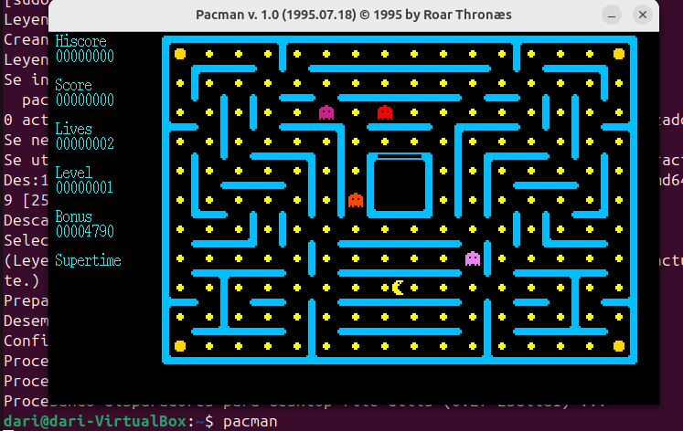
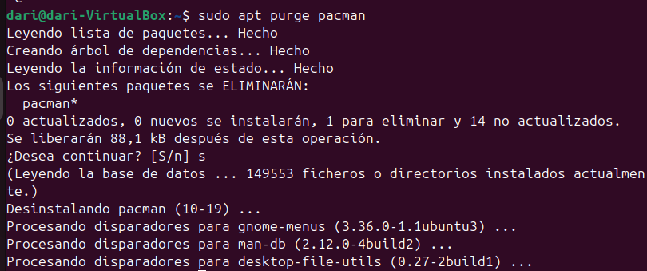

# __Instalación de programas__

En este apartado instalaremos aplicaciones en Ubuntu usando diferentes formas. 

### __Entorno gráfico__
Actualmente, Ubuntu ofrece la instalación de programas mediante su App Center. ES tan fácil como buscar la aplicación y descargarla mediante clicks.

### __apt install__

__Apt install__ es parte del conjunto de comandos de APT (Advanced Package Tool), que es el sistema de gestión de paquetes predeterminado en Ubuntu y Debian. Este comando se usa para instalar paquetes de software desde los repositorios oficiales o desde otras fuentes configuradas.

Funcionamiento de apt install:
Instalación de paquetes: Cuando ejecutas sudo apt install nombre_paquete, APT se conecta a los repositorios configurados, descarga el paquete, junto con las dependencias necesarias, y lo instala en el sistema.

Ahora después de instalarlo, en la misma consola escribo "pacman" para comprobar que se ha instalado correctamente y puedo jugar.

Ahora voy a borrarlo.

### __aptitude__

__Aptitude__ es otra herramienta de gestión de paquetes en Debian y Ubuntu que ofrece más funcionalidades que apt. Es más avanzado y ofrece tanto una interfaz de texto interactiva como un conjunto de comandos de línea similar a apt.

Funcionamiento de aptitude:
Interfaz gráfica en la terminal: Puedes lanzar una interfaz interactiva en la terminal donde puedes navegar, buscar, instalar, eliminar o actualizar paquetes con un sistema de menús.

### __dpkg__

__Dpkg__ se utiliza principalmente para instalar, eliminar y gestionar paquetes .deb de manera directa.

Conceptos básicos sobre dpkg:
Paquetes .deb: Los paquetes que dpkg maneja tienen la extensión .deb, que es el formato estándar de los paquetes de software en sistemas basados en Debian, como Ubuntu.

Instalación manual: A diferencia de apt, que se encarga de descargar los paquetes y resolver las dependencias automáticamente, dpkg se usa principalmente para instalar paquetes locales que ya has descargado en tu equipo.

### __Añadir repesitorios__

Añadir repositorios en Ubuntu permite acceder a software que no está en los repositorios oficiales, como versiones más recientes o programas propietarios (por ejemplo, Google Chrome o controladores de hardware). También facilita actualizaciones automáticas. Los repositorios son fuentes seguras y verificadas que permiten instalar y actualizar software de forma sencilla.

