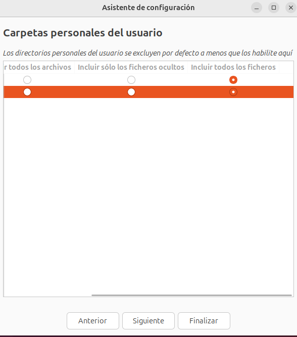
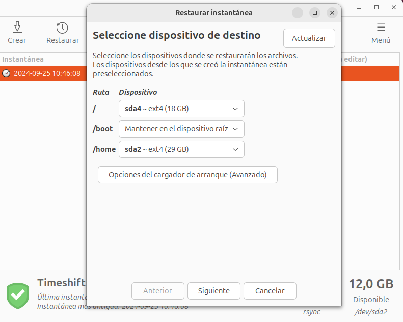

# __Puntos de restauración__

Anteriormente, en windows, habia una aplicación que venia con el sistema operativo llamada __System Restore__, dicha aplicación no realizaba cópias de seguridad de archivos ni los restaruaba, era solo para el sistema, actualmente en Windows 11 ya hay una opción en el panel de control para crear puntos de restauración para unidades.

Esto es lo que voy a hacer en Ubuntu instalando una aplicación llamada __timeshift__.

### __Timeshift__

Lo primero es instalarla, usando el terminal usamos la sintaxis "sudo apt install timeshift", aun que previamente va siempre bien asegurarse que el sistema se encuentra completamente actualizado, eso se puede hacer con la sintaxis "sudo apt update && upgrade -y"

Antes de abrir la aplicación voy a crear una carpeta.

Ahora voy a mirar en que partición esta almacenado el directorio "/home".

Ahora ya puedo abrir la aplicación y crear un punto de restauración.

Al abrirla lo primero que sale es un asistente de configuración que te pregunta que ficheros quieres incluir.
Yo selecciono que quiero todos los ficheros.

Presiono siguiente y me pregunta que partición quiero salvaguardar.
En este caso "/home" está montado en "sda2", como se puede comprobar en la segunda captura.

Presiono siguiente y ahora te pregunta cada cuánto quieres generar otro punto de restauración, aqui cada uno a conveniencia pone cada cuanto tiempo lo quiere.

Este ya ha sido el último paso. Ahora voy a comprobar que funciona borrando la carpeta creada previamente y usando el punto de restauración.

Vuelvo a abrir la aplicación __timeshift__ y me sale el punto de restauración que creé. Lo abro y le doy a todo siguiente.

Aquí puede que se te reinicie el ordenador, y ya está hecha la restauración, voy a comprobarlo haciendo un "ls" donde estaba la carpeta.

Funciona.